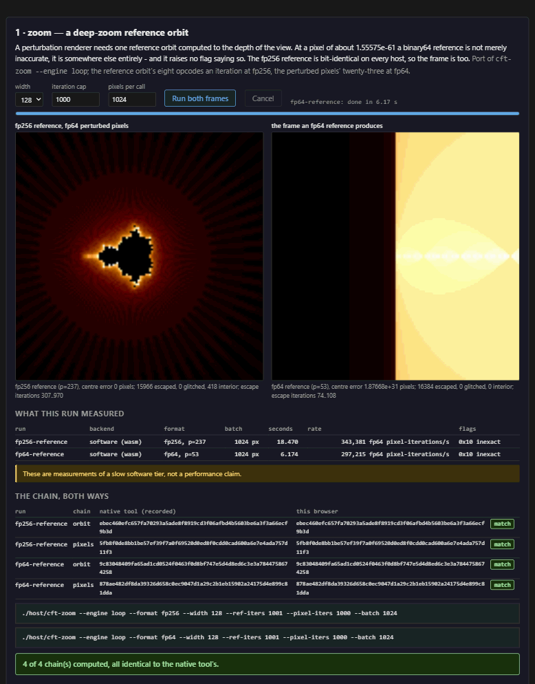

# cft-fp256

The Coordinated Fusion Compute Tile: a deterministic, dynamically
scalable IEEE 754-2019 math coprocessor - fp256 at the top of the
ladder, fracturing down to 8x fp32 lanes - built on the AMD/Xilinx
Alveo U50C (VU35P, 8 GB HBM2) through the open Vitis RTL kernel flow.

**The product is a contract, not a chip**: same inputs, same op, same
bits - on this tile, on the pure-Python golden model, and on any other
implementation that claims conformance. docs/DETERMINISM.md states the
contract clause-by-clause against IEEE Std 754-2019; `vectors/` makes
it scoreable.

The adoption story is two tiers with one contract. A software library
anyone can run on anything - the proven case is
[atlas-engine](https://github.com/loganw234/atlas-engine)'s pinned
GLSL det library, one hash across NVIDIA, AMD, and Intel GPUs - and
this hardware for heavy compute: identical bits, more speed, and
precision up to fp256 when the problem needs it (deep-zoom orbits,
reference oracles, interval arithmetic to come). The entry point stays
a simple library; the tile only makes it faster.

**What this is not for.** Raw fp32 and fp64 throughput. Every CPU and
GPU made serves those formats at clocks and lane counts an FPGA fabric
will not match, and nothing here tries to. binary32 and binary64 are
carried because they are rungs of the same IEEE 754 ladder as
binary128 and binary256, and carrying the whole ladder is what lets
one contract - bit-exact, deterministic, the same result on every
backend - cover all of them. Their support is a convenience and a
conformance story; the tile's reason to exist is the precision
commodity hardware does not offer, and docs/LAYOUTS.md says the same
of the fp32- and fp64-heavy tile mixes.

## What exists today

| piece | state |
|---|---|
| `python/cft_golden` | exact fp32/fp64/fp128/fp256, 30 opcodes (arithmetic, sign, min/max, predicates, integer/bitwise with a 32-bit multiply since 2026-09-07, and reductions with an index-fixed tree) under all five 754 rounding attributes, plus the full clause-5 contract function set (div/sqrt, roundToIntegral, every conversion, scaleB/logB, nextUp/nextDown, class, totalOrder, signaling compares, remainder), the transcendentals correctly rounded (exp/expm1/exp2/log/log1p/log2/log10/pow/hypot, sinPi/cosPi/tanPi/asin/acos/atan/atan2/asinPi/acosPi/atanPi/atan2Pi, and sin/cos/tan of a radian argument with sinh/cosh/tanh/asinh/acosh/atanh, and since ABI 0.6 the rest of Table 9.1 - exp2m1, exp10, exp10m1, log2p1, log10p1, rSqrt, pown, powr, compound, rootn - all thirty-nine, and since ABI 0.7 the cross-format arithmetic of 5.4.1 and the magnitude forms of 9.6, with the exact cases decided by exact arithmetic and proved complete by Niven's theorem and Hermite-Lindemann, and a Ziv loop over rigorous enclosures for the rest), and the orbit sequencer's execution model; dependency-free; **pytest green** against native binary64, `math.fma`, mpmath, math.remainder/nextafter/ldexp, an exact-rational rounding reference, and hand-computed 754 anchors |
| `rtl/` | the v1 16-stage pipelined FMA core (one parameterized source serving all four rungs: 8x fp32 / 4x fp64 / 2x fp128 / 1x fp256 per 256-bit beat), operand steering, ap_ctrl_hs CSR block with CAPS discovery, streaming engine with one AXI master per operand stream and pipelined address phases, a streaming reduction accumulator, the orbit sequencer (`cft_seq`: on-chip programs over the existing opcodes behind MODE[15], benched bit-exact against `seq.py`; hw_emu passing at fp32 through real XRT since 2026-09-02, once its reads were steered to the HBM bank that holds them), and **one ALU array per tile** (`cft_lanes`, owned by `cft_krnl`): the streaming engine and the sequencer each present a per-issue request and MODE[15] - already the AXI owner-select - says whose reaches the array, with no arbitration because they never run at once. The sequencer's private second copy is gone, and out of context at 135 MHz that is 288,764 -> 162,482 LUT a tile, 139,404 after the sequencer's control diet, 129,708 with the seed ROM as case tables and 123,420 with the round stage's arithmetic moved up a stage (2026-09-02, docs/ROADMAP.md). The optional fused ladders live in the array too (`FUSE_MUL`/`FUSE_NORM`/`FUSE_ALIGN`, **all default off**): the 2026-08-31 campaign's `FUSE_NORM`/`FUSE_ALIGN` stay equivalence-proven step by step and are worth 15,805 LUT here (139,404 -> 123,599), but they leave only +0.097 ns of out-of-context slack at 135 MHz against ladders-off's +0.307, and a shell build is what settled that a thin out-of-context margin is not a margin. BRAM-backed stream FIFOs, Vitis kernel top; the v0 behavioural core stays as the readable reference; **Yosys-clean** (CI-enforced portability). Since 2026-09-07 the leading-zero cone is a stage of its own (`cft_lzcone`, proven equal to the priority form it replaced at every window width; the cone left the routed critical path on both parts measured), the multiplier can be iterated (`MUL_PASSES`: 262 DSPs to 56 at ten passes, bit-identical, fp32 never slower), `CAPS` publishes the sequencer's capacities and the two new instructions, and the open-core configuration - ten passes, both ladders - routes at 100 MHz on a -2 Kintex-7 325T at 46% of the part and misses 120 by 0.078 ns (docs/ARCHITECTURE.md) |
| `tb/` | cocotb: streamed unit benches for all four widths + full-kernel AXI end-to-end via cocotbext-axi, every result and flag bit checked against the golden model - **green** across `make sim`'s 21 targets, and `make simmc`'s seventeen at ten passes with the board configuration among them (its engine-driven kernel under Verilator, which finishes the bench Icarus cannot - docs/VERIFICATION.md), including the reduction accumulator, full-kernel reductions, the divide/sqrt seed opcodes (85,264 comparisons), trimmed-build precision refusal, bus-fault injection, and the sequencer's unit and full-kernel benches against seq.py (Icarus 12, cocotb 1.9.2, in the `docker/` container). Two more targets sit beside the aggregate rather than in it, `krnlfused` and `krnlplain`, which run the full kernel with the fused ladders on and off and hold both to the same bits - the ladders are a resource trade, not a numeric one. Beside it, `formal/`: machine-checked proofs - the stream FIFO unbounded, the seed special-cases complete, the simpleops area rewrite proven equivalent over all 2^104 inputs, the leading-zero cone equal to the form it replaced, and the multi-cycle multiplier exact at the real chunk for every pass geometry the tile builds - 31 proofs and a negative control, about seven minutes (docs/VERIFICATION.md maps every gate and what it costs) |
| `hw/` | kernel.xml (== the CSR map), package_xo script, HBM link.cfg, the era-matched `rebuild-2022.sh` pipeline, `gen_layouts.py` + `layouts/` (every tile mix the U50 could carry, derived - docs/LAYOUTS.md) - **packaging and hw_emu gates MET** (bit-exact vs golden through real XRT), hw bitstreams built (docs/BRINGUP.md records each gate honestly) |
| `host/` | **libcft** - ~19,900 lines of C99 across `src/`, no dependencies, no build step for callers: one ABI reachable from Fortran, Julia, Python, Rust, C and C++ - the last of those through `host/include/cft.hpp`, a header-only C++17 layer (RAII for the handles, a fixed-width byte type per format, span batches, operators bound to an explicit context rather than a hidden global rounding attribute) that computes nothing itself and is held to the C entry points one by one, at C++17 and C++20, by `make -C host cpptest`. The software backend replays 1,223,635 conformance cases over 168 sets at the census's pool sizes (1,071,635 at `make vectors`') and agrees with the golden model on 216,000 differential cases; `cft_div`/`cft_sqrt` compose the tile's seed opcodes into correctly-rounded division and square root, proven against **23.9 billion cases of the host CPU's own IEEE hardware and 999,000 cases of GNU MPFR** (docs/VALIDATION.md); as of 2026-09-01 the **rest of clause 5** ships too - roundToIntegral, every conversion, scaleB/logB, nextUp/nextDown, class, totalOrder, signaling compares, exact remainder - composed or host-exact, zero new RTL, held identical to the model over 112,372 per-element checks; as of 2026-09-02 so do the **phase-1 transcendentals** (ABI 0.3), correctly rounded at every format under every attribute on a multiprecision evaluator built on the same bigint core, and as of 2026-09-03 the **phase-2 trigonometrics** (ABI 0.4) - sinPi, cosPi, tanPi, asin, acos, atan, atan2, asinPi, acosPi, atanPi, atan2Pi - the eleven whose argument reduction is exact, and as of 2026-09-03 the **phase-3 set** (ABI 0.5) - sin, cos, tan of a radian argument, reduced against a generated 270,336-bit 2/pi with the cancellation measured per format rather than assumed, and sinh, cosh, tanh, asinh, acosh, atanh - all thirty-nine since ABI 0.6 completed Table 9.1 - and with it clause 9.5's augmented arithmetic, all seven reductions of 9.4, clause 5.12's character conversions and 9.7's payload operations - held identical to the model over 607,217 per-element checks (with 140,088 augmented pairs, 12,696 reductions and 20,819 character conversions beside them) and to **GNU MPFR over 739,234 cases with zero value and zero flag mismatches**; an XRT backend drives up to 64 compute units and has been exercised against a **four-tile hw_emu image with no card present**; a remote backend puts a tile behind a socket with the same bits (docs/REMOTE.md), over TCP or WebSocket, so a Windows client or a browser computes on a Linux-hosted card; and the four parsers that face untrusted bytes are fuzzed under sanitizers (`host/fuzz/`, opt-in). Reductions add the tree-aware multi-tile split, so a sum over four tiles returns what one tile returns. The C and Python examples print identical checksums on Linux/glibc and Windows/msvcrt - as do C++, Rust, Julia, Go, C# and R, each on the platform and date docs/COMPATIBILITY.md records; Fortran reaches the same library through iso_c_binding and is the one example that prints no checksum line. **Validate the contract in your browser, nothing installed: https://loganw234.github.io/cft-fp256/** - the software backend compiled to WebAssembly, replaying the published vectors, the transcendental sets included since 2026-09-03, with a calculator panel that reaches every opcode, composed div/sqrt, all thirty-nine transcendentals, the augmented pairs, the scaled products and the character conversions; and a demos page at https://loganw234.github.io/cft-fp256/demos.html where the five contract workloads run in the browser on the same module bytes, each panel's SHA-256 chain checked against the C tool's - the zoom and orbits panels on their tools' program engine since 2026-09-07, when the sequencer's program API reached JavaScript |
| `vectors/` | deterministic conformance-set emitter (JSONL, seeded) |

No physical card yet; card day is 2026-09-08, and docs/CARDDAY.md is
the runbook, checked against today's library. The claim made so far is
narrower and checkable: the RTL is bit-exact against a golden model
that is itself proven against implementations sharing no code with
it, through the same interfaces XRT drives on silicon.

## Quickstart

Golden model self-tests (any Python 3.10+; mpmath optional but
recommended):

```bash
pip install pytest mpmath
make golden
```

RTL simulation - identical locally and in CI, via the container
(Docker Desktop on Windows works; native `make sim` needs Icarus):

```bash
make docker-image
make sim-docker
```

Or everything at once - the standardized verification run (model,
vectors, RTL suite, yosys, formal proofs, library gates, oracle spot
checks), resumable and logged, ending in a census block:

```bash
make verify
```

Conformance vectors:

```bash
make vectors
```

Hardware (needs Vitis/Vivado + XRT on a Linux box; see docs/BRINGUP.md
before running these):

```bash
make xo                                  # package rtl/ -> build/cft_krnl.xo
make xclbin TARGET=hw_emu                # emulation link
make xclbin PLATFORM=$(xbutil-reported)  # hardware link
```

The host library, which needs none of that:

```bash
make libcft            # C99, no dependencies
make libcft-test       # contract tests, the published sets replayed, C vs Python
make libcft-diff       # against the golden model, boundary-targeted
make libcft-docker     # the same tests on a second platform
```

And against a device, in emulation or on a card - the same command
either way, because the artifact's name selects the environment:

```bash
make -C host XRT=1 device-test
bash hw/run-device-test.sh cardday/quad/cft_hw.xclbin -n 4096
```

## Layout

```
python/cft_golden/   the definition of correct: exact softfloat + vector gen
python/tests/        golden proven against native f64, math.fma, mpmath, 754 anchors
rtl/                 cft_fpfma (core) / _pipe / cft_opmux, gathered into the
                     one per-tile array cft_lanes; cft_csr / cft_engine_stream /
                     cft_seq / cft_krnl; cft_mulpass and cft_normseg, the
                     iterated multiplier and the shared normalise ladder
tb/                  cocotb benches + Makefiles (SIM=icarus default, verilator alt)
hw/                  kernel.xml, package_kernel.tcl, link.cfg; mc_sweep.sh and
                     impl_krnl_ooc.tcl, the out-of-context timing builds
host/include/cft.h   the C ABI: the contract between this and its users
host/src/            libcft - software, XRT and remote backends, conformance
host/tests/          contract tests, device-vs-software, differential
host/fuzz/           the four parsers that face untrusted bytes, fuzzed (opt-in)
host/tools/          the workload tools, cft-asm (the assembler) and
                     positive-run (the image runner)
host/examples/       the same program in C, Python (ctypes), Julia, Rust,
                     Go, C# and R - byte-identical checksums, each on the
                     platform and date COMPATIBILITY.md records - plus the
                     Fortran iso_c_binding demonstration, the one example
                     outside that diff; the full language/drop-in matrix
                     with per-row verification status is
                     docs/COMPATIBILITY.md
bindings/            cftmpfr (the Python MPFR drop-in), the WASM build
                     behind the browser conformance page and the demos
                     page, and the Node package that loads that same
                     module outside a browser
formal/              the property proofs (make formal): FIFO, seeds,
                     simpleops equivalence, the leading-zero cone, the
                     multi-cycle multiplier's exactness, plus the negative
                     control - 31 tasks
verify/              the standardized verification runner (make verify):
                     every gate, one resumable logged run, census output;
                     docs/VERIFICATION.md is the map of every gate, what
                     each proves and how long each really takes
vectors/             conformance-set emitter (JSONL)
programs/            the program library: .cfta sources, a check per
                     program, a manifest of the built images
docker/              the simulation container CI and dev boxes share
docs/                DETERMINISM (the contract), ARCHITECTURE, HOSTAPI,
                     TRANSCENDENTALS (the correctly-rounded thirty-nine:
                     algorithms, error bounds, exactness proofs and the
                     Table Maker's Dilemma stated honestly),
                     SEQUENCER, SCALING, ROADMAP, BRINGUP, CARDDAY,
                     VERIFICATION (every gate, what it proves, and the
                     measured wall time - none of it is quick),
                     BENCHMARKS (the software tier measured against
                     MPFR, __float128 and the CPU itself, and the
                     five workloads written for the contract),
                     COLLATZ, ENCLOSE, MERSENNE, ORBITS, ZOOM (those
                     workloads: exact integers, rigorous enclosures,
                     Lucas-Lehmer, symplectic orbits, deep zoom),
                     DEMOS (the same five in the browser, chains
                     matched to the C tools),
                     ATLAS (the atlas-engine integration: the emitter
                     seam, the det library on the ISA - emitted and
                     bit-identical since 2026-09-07 - and the four asks,
                     two of them built),
                     PLATFORMS (the board and platform survey: what fits
                     the tile, what the licence covers, what to verify
                     before buying),
                     REMOTE (the tile behind a socket: the protocol,
                     what crosses the wire, and the OS answer),
                     NOVEL (results with no prior description found)
CAPABILITIES.md      what the tile can and cannot do, with the gaps named
```



*The five workloads of docs/BENCHMARKS.md run in the browser on the
module the conformance page embeds, at
https://loganw234.github.io/cft-fp256/demos.html; every panel prints the
SHA-256 chain it computed beside the C tool's, and they match
(docs/DEMOS.md).*

**Start with [CAPABILITIES.md](CAPABILITIES.md)** if you want to know
whether this is useful to you. It stays deliberately unflattering:
IEEE 754-2019 is now covered on the binary side as far as the
contract's stated exceptions allow. Every operation of clause 5 is
there: the six arithmetic operations (division and square root
composed from the tile's own seed opcodes and FMA), the completion set
from roundToIntegral to exact remainder, and - as of 2026-09-03 - the
character-sequence conversions of 5.12, decimal and hexadecimal in both
directions, correctly rounded with no cap on the digit count. So is
every recommended operation of clause 9 for binary formats: all
thirty-nine functions of Table 9.1, **correctly rounded** at every
format under every attribute with exact flags (docs/TRANSCENDENTALS.md
- a stronger claim than any libm makes and the only one that can be
scored), the seven reductions of 9.4 over a contractual tree, the three
augmented operations of 9.5 with their ties-toward-zero rounding, all
eight minimum/maximum operations of 9.6 (four as tile opcodes, the
magnitude four as host operations) and the three payload operations
of 9.7. Since ABI 0.7 (2026-09-04) the library **conforms to
IEEE 754-2019 in radix 2**, in the standard's own words (3.1.2):
binary32, binary64 and binary128 as supported arithmetic and
interchange formats and binary256 as a further one; every clause-5
operation for each of them, the cross-format forms of the six
arithmetic operations included; a status word lowered only by the
caller; the conformance predicates; and every recommended operation
of clause 9 for binary formats, the magnitude four of 9.6 among them.
docs/COMPLIANCE.md walks the standard clause by clause and is the
conformance statement. ABI 0.8 (2026-09-07) adds what the atlas port
asked for - a 32-bit integer multiply and constants indexed through
the immediate - and the sequencer's published capacities, each
announced in CAPS and refused by name on a device that lacks it. ABI
0.9 (2026-09-08) is the sequencer's second revision: thirty-two
registers a lane, 4,096 instructions, the constant bank as per-run
data with one digest over image and bank, and programs as files - a
text form, an assembler in two languages held byte for byte, a
library with a check per program, and a runner (docs/PROGRAMS.md).
What stays outside is named rather than implied: the
decimal formats (a different datapath, effectively their own tile),
clause 8's alternate exception handling, and NaN payload propagation
through arithmetic, which is a canonical quiet NaN by design. The
orbit sequencer is RTL now, holding bit-exact to `seq.py` through the
kernel's one ALU array in simulation and through hw_emu on the real
XRT stack - fp32 on 2026-09-02, and on 2026-09-08 all four formats'
programs on a four-tile image, 98 checks bit-exact; a bitstream that
carries a program, and silicon, are still ahead of it, and since
2026-09-07 a program can be loaded from JavaScript as well as from C. What it does
do, it does bit-exactly, and the file names every gap that remains.

## Design rules the repo is built around

- **One definition of correct.** The golden model is integer-exact
  Python with zero dependencies; RTL, host, and vectors are all scored
  against it, never against each other.
- **The contract outranks the implementation.** rtl/cft_opmux.sv,
  `softfloat.steer`, kernel.xml, and the CSR map each exist in exactly
  one other place (docs), and changes move together.
- **Claims stay measurable.** CI's green tick covers the golden gates
  and simulation; it does not cover synthesis, timing, or silicon -
  docs/BRINGUP.md owns those gates and says what "done" means for
  each, and docs/VERIFICATION.md maps every gate, what it proves and
  how long it really takes.
- **Everything open.** Apache-2.0; the toolchain path is the standard
  Vitis RTL kernel flow (`package_xo` + `v++`), host is pyxrt, and
  verification is cocotb + cocotbext-axi + mpmath - all open source.

## Where this is going

docs/ROADMAP.md, in one line each: v0.x puts this bitstream on the
card and reproduces the vectors (card day is 2026-09-08); the
sequencer with hardware-guaranteed deposition order already exists in
RTL and the rounding attributes shipped with it; the third tier after
the card is the same tile on an open Kintex-7 board - one tile at 46%
of a 325T, about 119 MHz on a -2 part with the multiplier iterated -
and the atlas parity column and the high-precision oracle role follow
from the program API and the det library's port, both of which now
exist.

## Neighbours

The workload this tile exists to serve is
[atlas-engine](https://github.com/loganw234/atlas-engine), and the
plates it evaluates are the
[PrettyCloud](https://github.com/loganw234/PrettyCloud) atlas at
prettycloud.io; docs/ATLAS.md is the assessment of what the backend swap
needs, and its first step is done: the det library emits as sequencer
programs, bit-identical to the pinned GLSL on 4,096-point sweeps
(atlas-engine branch `cft-detlib`), with the two instructions it asked
for now on the ISA. The camera whose census this README cites as its proven case is
atlas-darkroom, which is private, and it labels the citation from its
own side: one of the operator's projects vouching for another is worth
exactly what the census behind it is worth, and nothing more.

## License

Apache-2.0 (see LICENSE, NOTICE). Dependencies: cocotb (BSD-3),
cocotbext-axi (MIT), mpmath (BSD), pytest (MIT), XRT/pyxrt
(Apache-2.0) - all permissive, per the project's ground rule.
