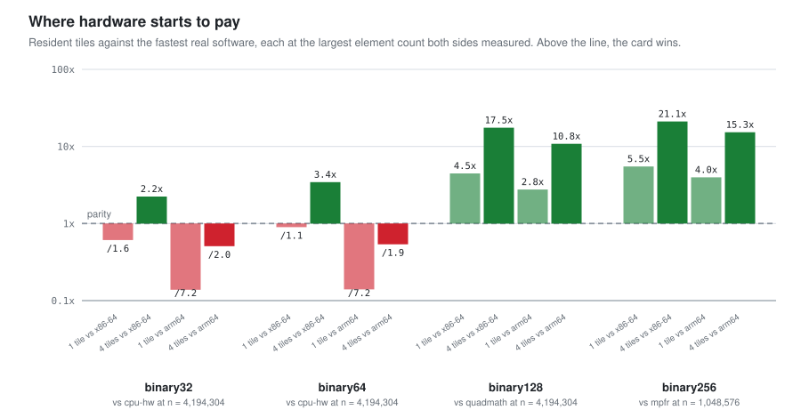
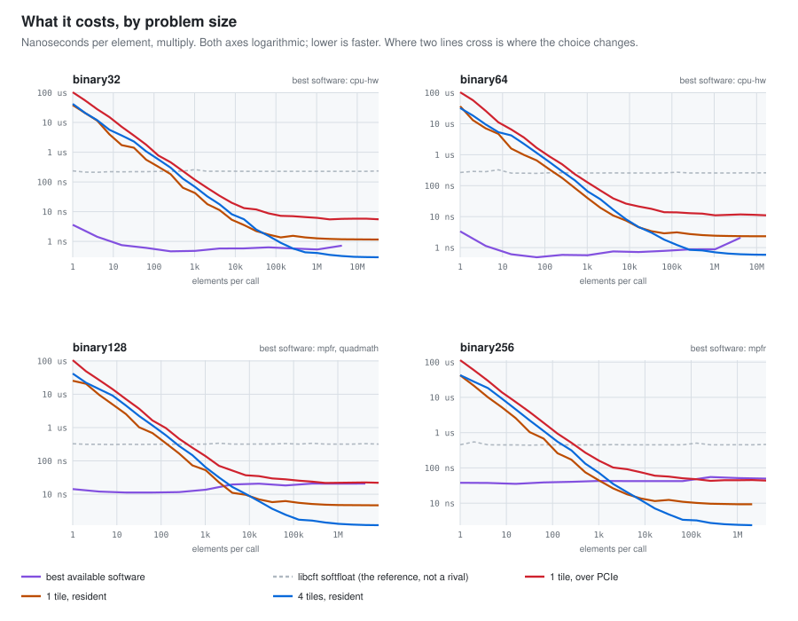

# cft-fp256

**A math coprocessor that gets the same answer everywhere.**

It does IEEE 754 arithmetic at four precisions - 32, 64, 128 and 256
bits - and guarantees that the same inputs give the same bits whether
the work runs on a laptop CPU, in a browser tab, on a microcontroller,
or on the FPGA card it was designed for.

That guarantee is the product. The hardware only makes it faster.

Formally it is the Coordinated Fusion Compute Tile, built for the
AMD/Xilinx Alveo U50 through the open Vitis RTL kernel flow - the card
here is a "U50C"-branded unit, and every build since first light has
linked against the standard U50 shell
(`xilinx_u50_gen3x16_xdma_5_202210_1`) - and everything here is
Apache-2.0.

| What it computes | How you call it | How it is checked | On the card | When it pays |
|---|---|---|---|---|
| binary32 / 64 / 128 / 256 | C, C++, Python, Rust, Julia, Go, C#, R, Fortran | **1,068,915** conformance cases | Alveo U50: 1,071,635 then 1,224,915 cases replayed on silicon | **binary128 4.5x**, **binary256 5.5x** |
| 31 opcodes, 5 rounding modes, 39 transcendentals | one ABI; software, FPGA or remote; no dependencies | **39** gate stages, 25 RTL sims, 30 proofs | 427 M elem/s, 4 tiles, ~35 W | **binary32 / 64: a CPU wins** |

<sub>Speed-ups are **multiply**, one tile against the fastest software on the same machine - the CPU's own FPU, `__float128` or MPFR, never our own softfloat. Four tiles reach 17.5x and 21.1x. Fused multiply-add is a different picture, and better: 14.0x at binary128 on one tile. [Where those lines fall, measured](#when-this-matters-and-when-it-does-not).</sub>

## Try it without installing anything

**<https://loganw234.github.io/cft-fp256/>**

That page is this project's software compiled to WebAssembly. It replays
the published conformance vectors in front of you, and its calculator
reaches every operation: all four precisions, all five rounding modes,
the thirty-nine transcendental functions, the character conversions.
Drop a vector file on it and it scores itself.

A second page,
[demos.html](https://loganw234.github.io/cft-fp256/demos.html), runs five
real workloads in the browser, each one's checksum chain matched against
the command-line tool's.

## Why this exists

Floating-point arithmetic is permitted to differ between machines, and
it does. Two GPUs from different vendors, or the same source through a
different compiler, can disagree in the last bits and then diverge. For
anything iterative - orbital mechanics, deep-zoom fractal geometry,
reproducible science - that ends the run.

The usual answer is to require agreement only within a tolerance. This
project takes the other route: define one exact result for every
operation, score every implementation against it, and make runs
reproducible bit for bit.

Exactness buys things a tolerance cannot. You can cache a result and
trust it later. You can replay a computation and get an identical trace.
You can compare two machines with `diff`.

The proven case is [atlas-engine](https://github.com/loganw234/atlas-engine)'s
geometry library, which produces **one hash across NVIDIA, AMD and Intel
GPUs**.

## What it is not for

Raw fp32 and fp64 throughput. Every CPU and GPU on the market serves
those formats at clocks and lane counts an FPGA fabric will not match,
and nothing here pretends otherwise. They are carried because they are
rungs of the same ladder as 128 and 256, and carrying the whole ladder
is what lets one contract cover all of it.

The tile earns its place at the precisions commodity hardware does not
offer, and on the guarantee that the answer does not move.

## Where it runs, and how fast

The same library, the same bits, on four very different machines. Rates
are for binary256, the widest and slowest format. What binary32 buys
depends on which row you are reading: on the tile it is about seven and
a half times faster (812 against 107 million elements a second,
resident, one tile), because the tile is beat-limited; in software the
gap is about 2.2x (3.76 against 1.74 million a second, one thread); and
the microcontroller row is in *cases* a second, not elements.

| where | what it is | binary256 throughput |
|---|---|---|
| a browser, or any CPU | the software library, no dependencies | 1.7 million elements a second |
| a microcontroller | the same C, on an ESP32-S3 over a serial line | a few hundred cases a second |
| the FPGA card, one tile | the same work, with the bus out of the way | 107 million elements a second |
| the FPGA card, four tiles | four times over | 427 million, at about 35 watts |

The microcontroller row is not a stunt. That part replayed **508,000
published conformance cases** - every binary32 and binary64 family,
complete - and disagreed with the reference on none of them. It is the
same library the card runs, compiled small.

### When this matters, and when it does not

The first row of that table is **this library's own softfloat**. It
defines the contract; it does not compete for speed. MPFR beats it by
six to nineteen times on add, multiply and fused multiply-add, and by
ninety-four to three hundred times on divide and square root. Charting
the card against it would produce speedups that are true, meaningless,
and the reason nobody believes accelerator numbers. So the baseline below is
the fastest implementation a user could actually reach for at each
format - the CPU's own FPU where the format has one, gcc's
`__float128` where the compiler has it, MPFR otherwise - measured by
`host/tools/cft_bench_peers.c` on two machines.

<picture>
  <source media="(prefers-color-scheme: dark)" srcset="docs/img/bench/when-hardware-pays-dark.svg">
  
</picture>

**Every figure in this section is multiply**, which is what the chart
plots (`python/readme_charts.py` sets `op = "mul"`). Fused
multiply-add moves the line, and always in the tile's favour: see the
end of this section.

**Read the losses first.** At binary32 and binary64 a single tile is
*slower* than a CPU - 1.6x and 1.1x behind an x86-64 workstation, and
7.2x behind an M2 Pro, which vectorises both formats hard. Four tiles
pass the workstation and still lose to the laptop. Those formats have
been in silicon for forty years, this tile runs at 135 MHz, and it was
never going to win them.

**At binary128 and binary256 that inverts and stays inverted** - 4.5x
and 5.5x on one tile, 17.5x and 21.1x on four, against the best
software on the same machine. The reason is structural rather than
clever: the tile is beat-limited, so one binary256 element costs it
exactly eight times a binary32 element, while software climbs far
faster than that. Two measurements from the same run make the point on
their own. `__float128` multiplies in 20.8 ns and *fuses* in 817 ns -
a 39x cliff inside one library, flat across every problem size,
because `fmaq` is a soft routine. And on Apple Silicon `__float128`
does not exist at all, so at binary128 MPFR is not the best
alternative there, it is the only one.

<picture>
  <source media="(prefers-color-scheme: dark)" srcset="docs/img/bench/cost-by-size-dark.svg">
  
</picture>

Size decides the rest. A device call has a fixed cost, so below a few
thousand elements software wins at every format; one tile passes MPFR
at about **1,000 elements** for binary256 and **2,700** for binary128.
And the gap between the two card curves is the bus: staging operands
across PCIe costs roughly five times running them from device memory,
so at binary256 **one tile over PCIe is about parity with MPFR** and
the win needs resident execution.

**On fused multiply-add the card does better, at every format.** The
same comparison, same runs, `op = "fma"`: at binary128 one tile is
14.0x and four tiles 55.1x against MPFR, and at binary32 and binary64
one tile is 1.55x and 1.25x *ahead* of the x86-64 workstation - not
because the tile improved but because glibc's `fma` is a function call
rather than an instruction. The M2 Pro still wins both narrow formats
(one tile reaches 0.19x and 0.18x of it). The headline figures above
stay on multiply because it is the honest comparison: the CPU does it
in one instruction.

Every number above is in `docs/bench/` - the raw sweeps, the peer
runs from both machines, and `tipping-points.json` with each crossing
and the bracket it was interpolated from. `docs/BENCHMARKS.md` carries
the tables and the method; the charts regenerate with
`python/readme_charts.py`.

## What is built and working

| piece | what it is |
|---|---|
| `python/cft_golden` | The definition of correct. Exact Python - integers only, the standard library alone for the arithmetic, with mpmath's interval context deciding the transcendentals: 31 opcodes, all five rounding modes, the complete IEEE clause 5 function set, and all thirty-nine transcendentals correctly rounded. Everything else is scored against this, never against each other. |
| `rtl/` | The tile. Fifteen 16-stage pipelined fused-multiply-add cores in four banks - 8x fp32, 4x fp64, 2x fp128, 1x fp256, each a separate pipe at its own significand width - plus operand steering, a streaming engine, a reduction accumulator and an on-chip program sequencer. (A shared fracturable multiplier exists behind `FUSE_MUL` and ships **off**: fracturing spends DSP blocks to save logic, which is the wrong trade on an FPGA - `docs/NOVEL.md` entry 6.) Yosys-clean, portability enforced in CI. |
| `tb/` and `formal/` | 25 simulation targets checking every result and every flag against the golden model, and 30 machine-checked proofs, plus a negative control that must be refuted or the gate has stopped being able to catch a bug. |
| `host/` | **libcft**: about 24,000 lines of C99 in `host/src`, no dependencies, no build step for callers. One ABI reachable from C, C++, Python, Rust, Julia, Go, C#, R and Fortran, with software, FPGA and remote backends behind identical calls. On a multi-tile card an elementwise call is split across every tile and a segmented reduction by whole segments; a whole-array reduction takes the largest power of two of the tiles, because only that cuts the tree at a node; and a sequencer program runs on tile 0 alone. |
| `bindings/` | The WebAssembly build behind the pages above, a Node package, and a Python drop-in for the MPFR pattern. |
| `hw/` | Vitis packaging, HBM layout and the build pipeline. Bitstreams built and run on silicon. |
| `vectors/` | The conformance sets: 1,068,915 cases, deterministic and seeded, at the counts `make vectors` passes the generator. The verification runner's `vectors` stage regenerates at the generator's own defaults instead, which is a larger census - 1,224,915 cases over the same 168 sets. |

Each of these has a document in `docs/` carrying the detail, the dates
and the measurements.

## How the claims are checked

One command runs the gates, in three sizes:

```bash
make verify-quick   # ~20 min, 26 of 39 stages: model-vs-C, the bindings,
                    # seven language legs, soak, the five workloads,
                    # the browser demos and the remote backend
make verify-gate    # ~2 h, 34 of 39: the above plus the golden model,
                    # vectors, libcft, transcendentals, MPFR, C++,
                    # the Yosys lint and the formal proofs
make verify         # the full census, hours: adds the cocotb suites,
                    # node, wasm and the staged images
```

Every stage names itself, logs itself and writes a `.ok` or `.fail`
marker; `--resume` continues an interrupted run and refuses to cross
commits. A stage whose tools are absent is **skipped by name with the
reason** rather than passed. `bash verify/run.sh --list` prints all 39 with
a `*` against the ones a given budget selects, and `docs/VERIFICATION.md`
maps what each one proves and how long it really takes.

What is being checked is written down once, as a profile an independent
implementation can be scored against: `CONFORMANCE.md`, which says where
this contract is stricter than IEEE 754, what it defines that the
standard does not, and which files and hashes "conforming" means.

The rule is that a number in a document has a run behind it, and the
runs that failed stay in the record. The load-bearing ones:

- **The card replayed the conformance sets on silicon**, through one
  tile and through four: 1,071,635 cases on 2026-09-08 and 2026-09-09,
  the published set as it then stood, and the runner's larger
  1,224,915-case generation on 2026-09-15, 09-16 and 09-18. The
  published set is **1,068,915** cases since opcode 31 was assigned on
  2026-09-12, and that exact set has been replayed on hosts rather than
  on the card. `docs/CARDDAY.md` is the runbook as it was actually run;
  `docs/VALIDATION.md` is the running record.
- **Division and square root** are held against 23.875 billion cases of
  the host CPU's own IEEE hardware - binary32 and binary64 only, that
  being where a CPU can arbitrate, and exhaustive binary32 square root
  under every attribute is 21.47 billion of it.
- **MPFR arbitrates all four formats**: the 999,000-case parity run
  covers add, subtract, multiply, fused multiply-add, divide and square
  root together, under all five attributes (2026-08-31).
- **The transcendentals** are held against MPFR over 306,460 cases -
  the transcendental share of a 739,234-case campaign at ABI 0.7
  (2026-09-04) - with zero value and zero flag mismatches.
- **A GPU agrees, bit for bit, on a real workload.** atlas-engine's
  deterministic camera around a plate, lowered to a sequencer program:
  a million samples a pass, five words a sample, and every pass's
  deposit buffer is the one an NVIDIA RTX 5060 Ti recorded while
  rendering the same frame from pinned GLSL - on the U50's tile and on
  the software backend alike (2026-09-18). It is the one check here
  whose expected bits this project did not compute, and the `photograph`
  stage reruns it in a minute and a half.
- **The same program in nine languages**, of which **eight print
  byte-identical checksums** - FNV-1a over the raw output encodings, so
  no locale or decimal spelling can get into the line being diffed.
  The ninth, Fortran, builds and runs through `iso_c_binding` and
  prints decimals rather than a checksum line, so it is the one example
  not in that diff. Each on the platform and date
  `docs/COMPATIBILITY.md` records.
- **CI's green tick does not cover synthesis, timing or silicon.**
  `docs/BRINGUP.md` owns those gates and defines "done" for each;
  `docs/VERIFICATION.md` maps every gate, what it proves, and how long
  it really takes.

## Quickstart

The golden model's self-tests (any Python 3.10+, mpmath optional but
recommended):

```bash
pip install pytest mpmath
make golden
```

The host library, which needs no FPGA toolchain at all:

```bash
make libcft            # C99, no dependencies
make libcft-test       # contract tests, the published sets replayed, C vs Python
make libcft-diff       # against the golden model, boundary-targeted
```

RTL simulation, identical locally and in CI through the container:

```bash
make docker-image
make sim-docker
```

Everything at once - model, vectors, RTL suite, yosys, formal proofs,
library gates, oracle spot checks - resumable and logged:

```bash
make verify
```

Hardware needs Vitis/Vivado and XRT on a Linux box. Read
`docs/BRINGUP.md` first:

```bash
make xo                                  # package rtl/ -> build/cft_krnl.xo
make xclbin TARGET=hw_emu                # emulation link
make xclbin PLATFORM=$(xbutil-reported)  # hardware link
```

Against a device, in emulation or on a card. The same command either
way, because the artifact's name selects the environment:

```bash
make -C host XRT=1 device-test
bash hw/run-device-test.sh cardday/quad/cft_hw.xclbin -n 4096
```

## Layout

```
python/cft_golden/   the definition of correct: exact softfloat + vector gen
python/tests/        golden proven against native f64, math.fma, mpmath, 754 anchors
rtl/                 the FMA core, the per-tile lane array, the CSR block,
                     the streaming engine, the sequencer, the kernel top
tb/                  cocotb benches + Makefiles (SIM=icarus default, verilator alt)
formal/              the property proofs (make formal): 30 tasks + a negative control
hw/                  kernel.xml, packaging, link.cfg, out-of-context timing builds
host/include/cft.h   the C ABI: the contract between this and its users
host/src/            libcft - software, XRT and remote backends, conformance
host/tests/          contract tests, device-vs-software, differential
host/fuzz/           the four parsers that face untrusted bytes, fuzzed (opt-in)
host/tools/          the workload tools, the assembler, the image runner
host/examples/       the same program in nine languages; eight print byte-identical
                     checksums, Fortran prints its own decimals instead
bindings/            the WASM build, the Node package, the Python MPFR drop-in
verify/              the standardized verification runner (make verify)
vectors/             conformance-set emitter (JSONL)
programs/            the program library: sources, a check per program, a manifest
docker/              the simulation container CI and dev boxes share
docs/                one file per subject; see below
```

In `docs/`, start with **DETERMINISM** (the contract itself),
**ARCHITECTURE** (how the tile works), **HOSTAPI** (how to call it) and
**INTEGRATION** (which path to use, and where each one's wall is).
**VERIFICATION** maps every gate and its real cost; **VALIDATION** is the
running record of what was run and what it said, with failures kept
beside passes. **EMBEDDED** covers the microcontroller row above,
**REMOTE** the tile behind a socket, and **BENCHMARKS** the measured
throughput and what bounds each number.

## Design rules the repo is built around

- **One definition of correct.** The golden model is integer-exact
  Python: the arithmetic needs nothing but the standard library, and
  the transcendentals need mpmath, whose interval context is what
  decides a result that is not exact. RTL, host and vectors are all
  scored against it, never against each other.
- **The contract outranks the implementation.** Each shared definition
  exists in exactly one other place, and changes move together.
- **Claims stay measurable.** A number has a run behind it, and a
  hypothesis that turned out wrong stays in the record with the
  measurement that killed it.
- **Everything open.** Apache-2.0, the standard Vitis flow, and a
  verification stack of cocotb, mpmath and pytest - all permissive.

## Where this is going

`docs/ROADMAP.md` has the detail. In short: the card is up and
reproducing the vectors; the next tier is the same tile on an open
Kintex-7 board, where one tile fits in 53% of a 325T; and the roadmap
carries what the first outside workload asked the library for, ranked
by measurement rather than by guess - six of its seven asks built by
2026-09-15, the last four of them as one parcel round
(`docs/ROUND2.md`) and measured on the card the same night.

## Built on it

**[cft-rebound](https://github.com/loganw234/cft-rebound)** is the first
application here that is somebody else's algorithm rather than this
project's own: [REBOUND](https://github.com/hannorein/rebound)'s IAS15,
a fifteenth-order adaptive N-body integrator used in real
orbital-dynamics research, with every floating-point operation routed
through libcft. The same integration then runs at binary64, binary128
and binary256, and on the tile.

It is a separate repository under GPL-3.0, because REBOUND is GPL-3.0
and Apache-2.0 combines into that licence but not the reverse.

What it has shown so far:

- **At binary64 the port is REBOUND's own IAS15, bit for bit.** That
  equivalence is the correctness gate, and it holds across long runs and
  the awkward paths - rejected steps, iteration caps.
- **On the card, every comparison against the software backend produced
  an identical record.** Not only the trajectories: the adaptive
  corrector took the same number of passes, which a single differing bit
  would have moved.
- **binary128 is worth having; binary256 mostly is not, for this
  integrator.** IAS15 was designed to sit at the binary64 round-off
  floor, and moving to binary128 recovers about four orders of magnitude
  of accuracy at once. Going further to binary256 changes nothing on the
  same test, because the method's own truncation error dominates by
  then. That is a negative result, measured and kept.
- **One tile overtakes the software backend somewhere between 6 and 64
  bodies, and is still pulling away at 512.** Measured 2026-09-14 on a
  one-tile binary128 image at 150 MHz, against the same integration in
  software at binary128 (cft-rebound's `docs/VALIDATION.md`, entry 37):
  0.13 to 0.25x on two-, three- and six-body problems, 2.2x at 64
  bodies, 3.7x at 256 and 3.9x at 512 - no plateau seen. The engine's
  width is its whole advantage and a small system leaves it idle; the
  point where that turns over was not sampled between 6 and 64. Two
  results from the same run that a first reading would get wrong: four
  tiles and six were *slower* than one at every size, because the
  library partitions an elementwise call across every tile and this
  integrator issues thousands of short calls a step; and at 256 bodies over half
  the card's time was the correctly rounded divide and square root, not
  the tile - which is now the first thing that integrator asks of this
  library.

It also sent work back the other way. What that integrator asked for
is recorded in `docs/ROADMAP.md`, ranked by measurement, and by
2026-09-15 six of its seven asks were built - the device-side gather
(its scatter is a gather by a static table and a fold), the per-run
lane mask, the scalar broadcast, the per-segment reduction - and
measured on the card the same night: one indexed program run replaces
127 dense calls at 1.5 to 1.7 times their speed and removes the host
gathers with them (`docs/VALIDATION.md`, the card day of 2026-09-15).
The general lesson about irregular access patterns is in
`docs/INTEGRATION.md`.

The port is in active development and its own `docs/VALIDATION.md`
carries the numbers, the dates and the failures.

## Neighbours

The workload this tile exists to serve is
[atlas-engine](https://github.com/loganw234/atlas-engine), and the plates
it evaluates are the
[PrettyCloud](https://github.com/loganw234/PrettyCloud) atlas at
prettycloud.io. `docs/ATLAS.md` assesses what the backend swap needs; its
first step is done, with that library emitting as sequencer programs
bit-identical to the pinned GLSL over 4,096-point sweeps.

The camera whose census this README cites as its proven case is
atlas-darkroom, which is private, and it labels the citation from its own
side: one of the operator's projects vouching for another is worth
exactly what the census behind it is worth, and nothing more.

## License

Apache-2.0 (see LICENSE, NOTICE). Dependencies: cocotb (BSD-3),
cocotbext-axi (MIT), mpmath (BSD), pytest (MIT), XRT/pyxrt (Apache-2.0)
- all permissive, per the project's ground rule.
